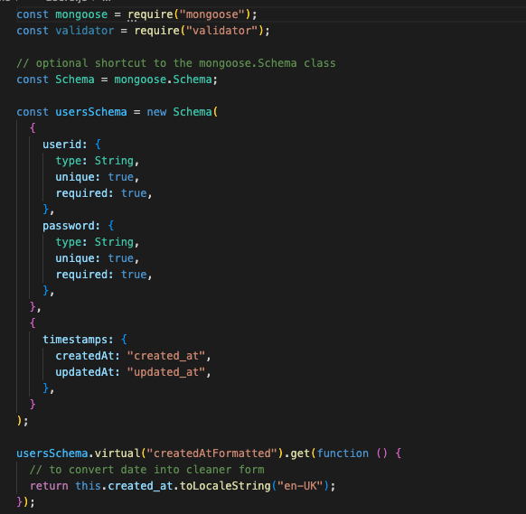
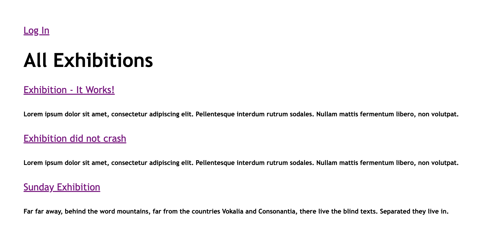
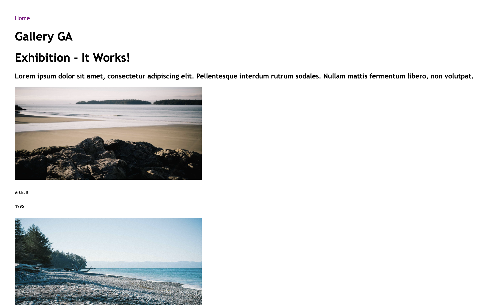
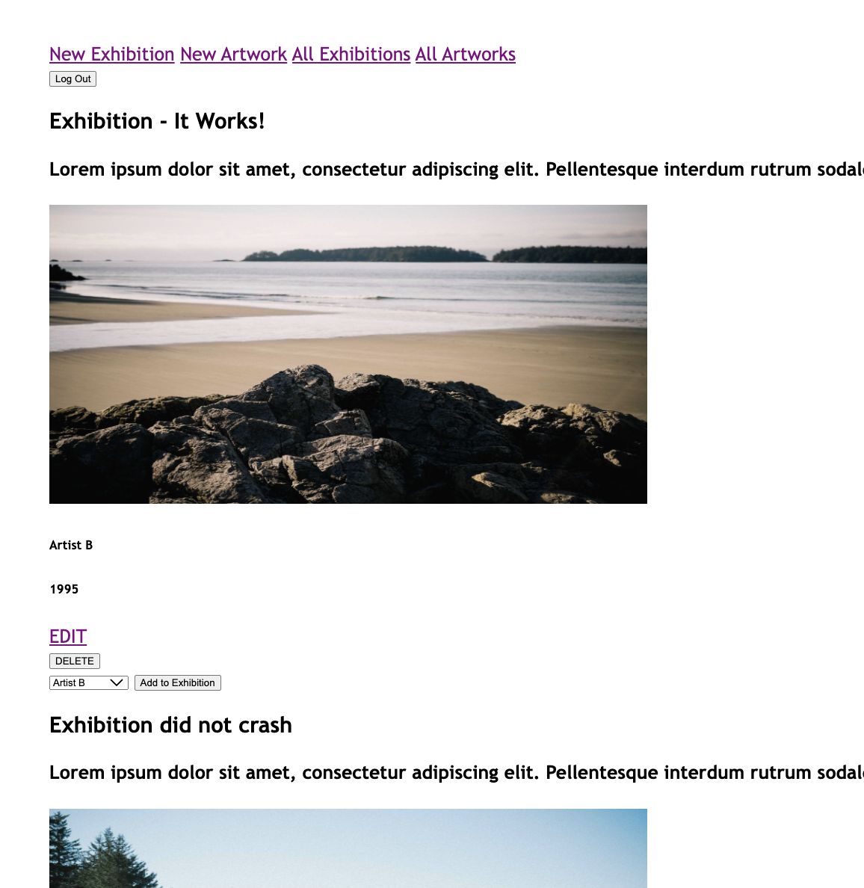
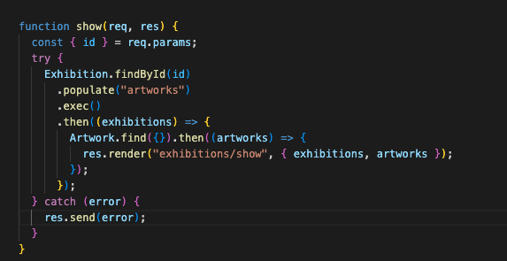
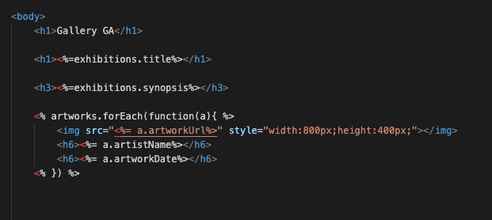

# Gallery GA

Gallery GA is an online exhibition hosting app that allows users to do mock ups of online exhibitions. The user as visitor is allowed to browse through the exhibitions and the artworks that are located in them, while the authorized admin has full CRUD function that allows them to cread,edit and delete exhibitions and its assigned artworks.

Give the app a try here ->

default admin : sundayAdmin , pw : password

---

## Model

The approach to constructing the app revolved around having the artworks being the central resource. They can be used and applied to future use applications such as article posts and sorting by genre. Therefore the primary method of linking the models together are through referencing as they have a many to many relationship. For this instance, it is referenced in the exhibition model.

---

## Screenshots

Home page of app

User access to selected exhibition

Admin access to Nav bar and CRUD functions

---

## Technologies Used

This app was created with the following:

- Node.js
- Express.js
- Javascript
- Mongo DB
- EJS
- Cyclic
- GitHub

---

## Development Approach and Considerations

- Admin Access

The admin user has the main access over the CRUD functions of the app, therefore a layer of authorization has to be created to prevent the public user from having access to the files. The authorized user is rendered a different home page that features the nav bar to the CRUD options as well as the exhibition/artist Index. This was created by showing the links through the EJS partials and setting authorization to the appropriate routes.

The public user route used similar functions to the one with the authorized one, but with the referencing model and fetching data through mongoose, they do not have access to the database.

Function to fetch data from MongoDB through the exhibition's id

Fetching the data into the EJS views.

---

## Future Developments

- Tune validators to route back to the input field with appropriate prompts
- Search function to find exhibition or artwork
- Include styling through CSS to manage the size of images
- Include function to delete artworks from the exhibition CRUD interface

## Thoughts and Feels

- Planning for a CRUD project works better once you go through the process and realize how complex the relationships of the routes can be. It gave me a better understanding of how the functions work as well as planning for a user/admin interface

- A good point of entry to find better approaches to assigning values from different models to each other in a neater way.
